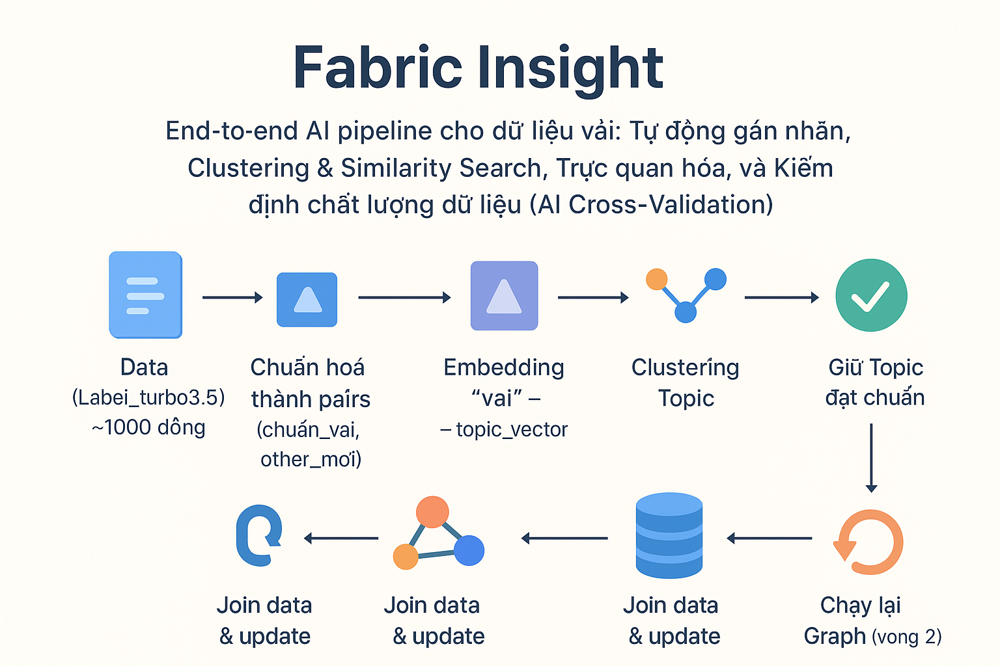

# 🧵 Fabric Insight AI
> **End-to-end AI Pipeline** cho dữ liệu vải: **Tự động gán nhãn**, **Clustering & Similarity Search**, **Trực quan hóa**, và **Kiểm định chất lượng dữ liệu (AI Cross-Validation)**  
> Giúp doanh nghiệp **rút ngắn thời gian phân tích từ tháng xuống tuần**, giảm chi phí nhân sự và tăng độ chính xác dữ liệu.

---

## 📌 Giới thiệu
**Fabric Insight AI** là hệ thống AI toàn diện giúp doanh nghiệp ngành dệt may:
- **Tự động gán nhãn** dữ liệu vải với độ chính xác ~95%.
- **Phân cụm (Clustering)** để nhóm các loại vải tương đồng.
- **Tìm kiếm tương đồng (Similarity Search)** cho truy vấn nhanh và chính xác.
- **Kiểm định chất lượng dữ liệu (QA)** để giảm thiểu sai sót con người.
- **Trực quan hóa dữ liệu** qua dashboard đẹp, dễ phân tích.

Kết quả:  
- Giảm **87% thời gian gán nhãn** (2 ngày → 3 giờ).
- Chuẩn bị dataset từ **2 tháng → 3 tuần**.
- Giảm lỗi kiểm định xuống **<5%**.

---

## 🚀 Kết quả nổi bật
| Hạng mục                | Trước AI  | Sau AI  | Cải thiện |
|-------------------------|-----------|---------|-----------|
| Thời gian gán nhãn      | 2 tháng   | 3 tuần  | -87%      |
| Thời gian phân tích     | 1 tháng   | 2 tuần  | -87%      |
| Độ chính xác Auto-label | 80%       | 95%     | +15%      |
| Clustering Accuracy     | ~70%      | ~90%    | +20%      |
| Lỗi kiểm định           | 15%       | <5%     | -66%      |

---

## 🎯 Giá trị cho doanh nghiệp
- **Tiết kiệm chi phí nhân sự** nhờ tự động hóa.
- **Ra quyết định nhanh hơn** nhờ dữ liệu chính xác và phân tích real-time.
- **Giảm phụ thuộc vào chuyên gia** cho các tác vụ thường nhật.
- **Dễ mở rộng** sang nhiều ngôn ngữ và lĩnh vực khác (retail, e-commerce, logistics).

---

## 📊 Pipeline Hệ Thống

  

<em>Hình 1: Quy trình xử lý dữ liệu và phân tích trong dự án Fabric Insight.</em>

---

## ⚙️ Công nghệ sử dụng
- **Ngôn ngữ**: Python 3.10+
- **Machine Learning & NLP**: SentenceTransformers (embedding & semantic similarity), scikit-learn (mô hình ML truyền thống), BERTopic (chủ đề & phân cụm văn bản)
- **Data Processing**: `pandas`, `numpy`
- **Visualization**: `Plotly`, `Matplotlib`, `Seaborn`
- **Search & Retrieval**: Cosine Similarity, Faiss
- **Deployment**: REST API / Flask 

---

## 🛠️ Quy trình hoạt động
1. **Data Ingestion** – Nạp và chuẩn hóa dữ liệu vải từ nhiều nguồn.
2. **Embedding Generation** – Biến dữ liệu văn bản thành vector embedding.
3. **Clustering** – Gom nhóm các mẫu vải tương đồng.
4. **Auto Labeling** – Gán nhãn tự động dựa trên cụm & từ khóa.
5. **Similarity Search** – Tìm kiếm nhanh dựa trên vector.
6. **Quality Assurance** – AI kiểm tra, con người xác nhận (Human-in-the-loop).
7. **Visualization** – Dashboard trực quan giúp phân tích nhanh.

---

## 📈 Benchmark & Hiệu suất
- **Auto-Labeling**: 95% accuracy, giảm 80% công sức thủ công.
- **Clustering**: ~90% accuracy so với nhãn chuẩn.
- **QA**: Lỗi kiểm định <5%.
- **Thời gian phân tích**: từ days → hours.

---

## 🔮 Hướng phát triển
- **Active Learning** để model tự cải thiện theo phản hồi người dùng.
- **Tích hợp API** vào hệ thống ERP / CRM của doanh nghiệp.
- **Đa ngôn ngữ** (Anh, Trung, Nhật) cho thị trường toàn cầu.
- **Ứng dụng trên hình ảnh vải** (Computer Vision) để kết hợp phân tích văn bản + hình ảnh.

---

## 📜 Giấy phép
Dự án được phân phối theo giấy phép MIT – tự do sử dụng, chỉnh sửa và phân phối.

---

## 🤝 Đóng góp
1. Fork repo
2. Tạo branch mới (`feature/ten-tinh-nang`)
3. Commit thay đổi
4. Mở Pull Request

---

## 📧 Liên hệ
- **Tác giả**: Nguyễn Tiên
- **Email**: camtienn031103.email@example.com
- **LinkedIn**: https://www.linkedin.com/in/ti%C3%AAn-nguy%E1%BB%85n-6a6704354/
